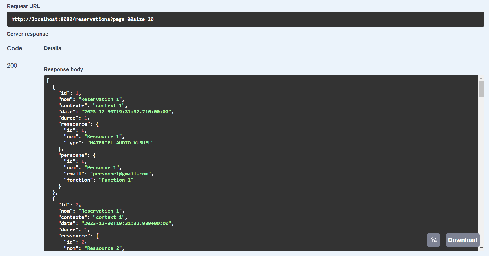
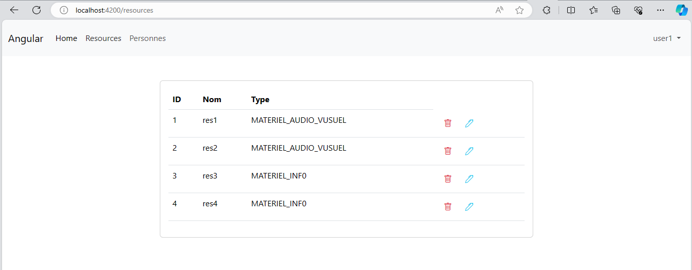
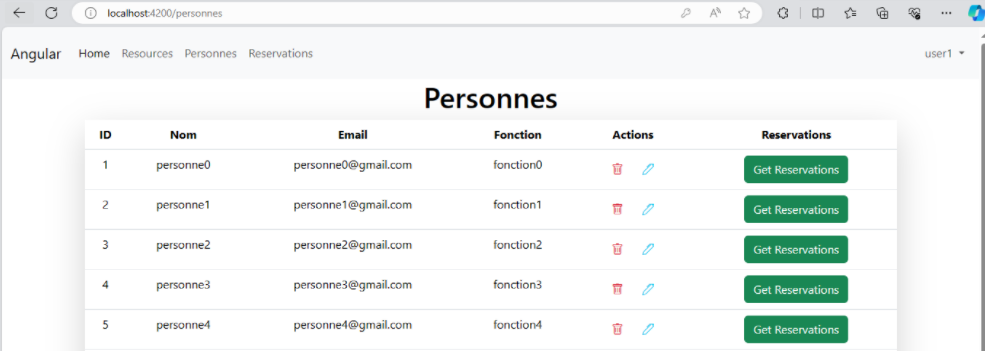
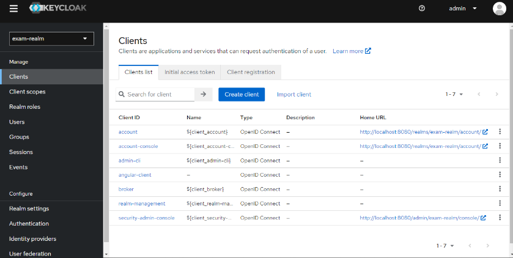

#  Application de gestion de réservation de ressources
## Introduction

Nous souhaitons créer une application basée sur une architecture de micro-services qui permet de gérer
les réservations de ressources. Chaque réservation concerne une seule ressource. Le système se compose 
de trois micro-services techniques à mettre en place :

- Le service Gateway basé sur Spring cloud Gateway
- Le service Discovery basé sur Eureka Server Discovery
- Le service de configuration basé sur la configuration cloud Spring

Et deux autres micro-services :

Service Ressource : qui permet de gérer des ressources, une ressource est définie par son id, son nom, son type (MATERIEL_INF0, MATERIEL_AUDIO_VUSUEL)
Service de Réservation : qui permet de gérer les réservations effectuées par des personnes. Une réservation est définie par son identifiant, son nom,
son contexte, sa date, sa durée. Chaque réservation est effectuée par une seule personne. Une personne est définie par son identifiant, son nom, son email et sa fonction.

## Outils


```
- Spring Cloud
- Eureka Discovery
- H2DataBase
- Keycloak
- Docker
```

##  Structure du Projet
```
Ressource-Reservation-App

  |__ angular-app
        |__ src
            |__ assets
            |__ app
                |__ guard
                |__ models
                |__ pages
                    |__ personne-detail
                    |__ personne
                    |__ reservation-detail
                    |__ reservation
                    |__ ressource
                    |__ welcome
                |__ services

  |__ config-git-repo
        |__ applications properties files

  |__ config-service
        |__ src
            |__ main
                |__ java/com/exemple/configservice
                |__ resources

  |__ discovery-service
        |__ src
            |__ main
                |__ java/com/exemple/discoveryservice
                |__ resources

  |__ gateway-service
        |__ src
            |__ main
                |__ java/com/exemple/gatewayservice
                |__ resources

  |__ reservation-service
        |__ src
            |__ main
                |__ java/com/exemple/reservationservice
                    |__ dto
                    |__ entities
                    |__ enums
                    |__ mappers
                    |__ repository
                    |__ ressource
                    |__ security
                    |__ service
                    |__ web
                |__ resources

  |__ ressource-service
        |__ src
            |__ main
                |__ java/com/exemple/ressourceservice
                    |__ dto
                    |__ entities
                    |__ enums
                    |__ mappers
                    |__ repository
                    |__ security
                    |__ service
                    |__ web
                |__ resources
```
<br>

## Eureka Service 
<table align="center">
  <tr>
    <th>Run</th>
    <th>Test</th>
  </tr>
  <tr>
    <td></td>
    <td></td>
  </tr>
</table>
<br>

## Config & Gateway Service
<table align="center">
  <tr>
    <th>Config Actuator</th>
    <th>Gateway Actuator</th>
  </tr>
  <tr>
    <td></td>
    <td></
  </tr>
</table>
<br>

## Ressource Service API Doc
<table align="center">
  <tr>
    <th>Rest API</th>
    <th>Get</th>
   </tr>
  <tr>
    <td></td>
    <td></td>
  </tr>
    <th>Post</th>
    <th>Get Id</th>
  <tr>
    <td></td>
    <td></td>
  </tr>
   </tr>
    <th>Update</th>
    <th>Delete</th>
  <tr>
    <td></td>
    <td></td>
  </tr>
</table>
<br>

## Reservation Service API Doc
<table align="center">
  <tr>
    <th>Reservation Rest API</th>
    <th>Personne Rest API</th>
   </tr>
  <tr>
    <td></td>
    <td></td>
  </tr>
    <th>Get Reservation</th>
    <th>Post Personne</th>
  <tr>
    <td></td>
    <td></td>
  </tr>
  </tr>
    <th>Update Reservation</th>
    <th>Delete Personne</th>
  <tr>
    <td></td>
    <td></td>
  </tr>
</table>


## Angular Frontend


    Authentication
  <tr>
    <td></td>
  </tr>

<table align="center">
  
  <tr>
    <th> Table Ressource</th>
    <th> Table Personne</th>
  </tr>  
  <tr>
    <td></td>
    <td></td>
  </tr>
  <tr>
    <th>Table Reservation</th>
    <th>Edit Reservation</th>
  </tr>
  <tr>
    <td></td>
    <td></td>
  </tr>
  <tr>
    <th>Personne du reservation</th>
    <th>Les ressources du reservation</th>
  </tr>
  <tr>
    <td></td>
    <td></td>
  </tr>

</table>

<br><br>

<br>

## Securité de l'application
Sécurisez l'application avec Keycloak pour l'authentification.


<br></br>

<br></br>

<br></br>

<br></br>


## Déploiement Docker
```java
services:
  postgres-service:
    image: postgres
    container_name: postgres-service
    volumes:
      - postgres_data:/var/lib/postgresql/data
    environment:
      POSTGRES_DB: keycloak
      POSTGRES_USER: keycloak
      POSTGRES_PASSWORD: ****
    ports:
      - '5432:5432'
    expose:
      - '5432'
    healthcheck:
      test: "exit 0"
  pgadmin4:
    image: dpage/pgadmin4
    container_name: pgadmin4
    restart: always
    ports:
      - "8083:80"
    environment:
      PGADMIN_DEFAULT_EMAIL: med@gmail.com
      PGADMIN_DEFAULT_PASSWORD: ****
    volumes:
      - pgadmin_data:/var/lib/pgadmin
  keycloak:
    image: quay.io/keycloak/keycloak:latest
    environment:
      KC_DB: postgres
      KC_DB_URL: jdbc:postgresql://postgres-service:5432/keycloak
      KC_DB_USERNAME: keycloak
      KC_DB_PASSWORD: ****
      KEYCLOAK_ADMIN: admin
      KC_HTTP_ENABLED: "true"
      KC_HOSTNAME_STRICT_HTTPS: "false"
      KEYCLOAK_ADMIN_PASSWORD: ****
    command:
      - start-dev
    restart: always
    ports:
      - '8080:8080'
    expose:
      - '8080'
    depends_on:
      - postgres-service
  discovery-service:
    build: ./discovery-service
    container_name: discovery-service
    ports:
      - '8761:8761'
    expose:
      - '8761'
    healthcheck:
      test: [ "CMD", "curl", "-f", "http://localhost:8761/actuator/health" ]
      interval: 10s
      retries: 4
  config-service:
    build: ./config-service
    container_name: config-service
    ports:
      - '9999:9999'
    expose:
      - '9999'
    environment:
      - DISCOVERY_SERVICE_URL=http://discovery-service:8761/eureka
    healthcheck:
      test: [ "CMD", "curl", "-f", "http://localhost:9999/actuator/health" ]
      interval: 10s
      retries: 4
    depends_on:
      discovery-service:
        condition: service_healthy
  gateway-service:
    build: ./gateway-service
    container_name: gateway-service
    ports:
      - '8888:8888'
    expose:
      - '8888'
    environment:
      - DISCOVERY_SERVICE_URL=http://discovery-service:8761/eureka
      - CONFIG_SERVICE_URL=http://config-service:9999
    depends_on:
      config-service:
        condition: service_healthy
  ressource-service:
    build: ./ressource-service
    container_name: ressource-service
    ports:
      - '8081:8081'
    expose:
      - '8081'
    environment:
      - DISCOVERY_SERVICE_URL=http://discovery-service:8761/eureka
      - CONFIG_SERVICE_URL=http://config-service:9999
      - JWT_ISSUER_URI=http://keycloak:8080/realms/exam-realm
      - JWT_JWK_SET_URI=http://keycloak:8080/realms/exam-realm/protocol/openid-connect/certs
    depends_on:
      config-service:
        condition: service_healthy
  reservation-service:
    build: ./reservation-service
    container_name: reservation-service
    ports:
      - '8082:8082'
    expose:
      - '8082'
    environment:
      - DISCOVERY_SERVICE_URL=http://discovery-service:8761/eureka
      - CONFIG_SERVICE_URL=http://config-service:9999
      - JWT_ISSUER_URI:http://keycloak:8080/realms/exam-realm
      - JWT_JWK_SET_URI:http://keycloak:8080/realms/exam-realm/protocol/openid-connect/certs
    depends_on:
      - ressource-service
  angular-app:
    build: ./angular-app
    container_name: angular-app
    ports:
      - '8085:80'
    expose:
      - '8085'
    restart: always
    depends_on:
      - keycloak
      - ressource-service
      - reservation-service
volumes:
  postgres_data:
  pgadmin_data:
```
